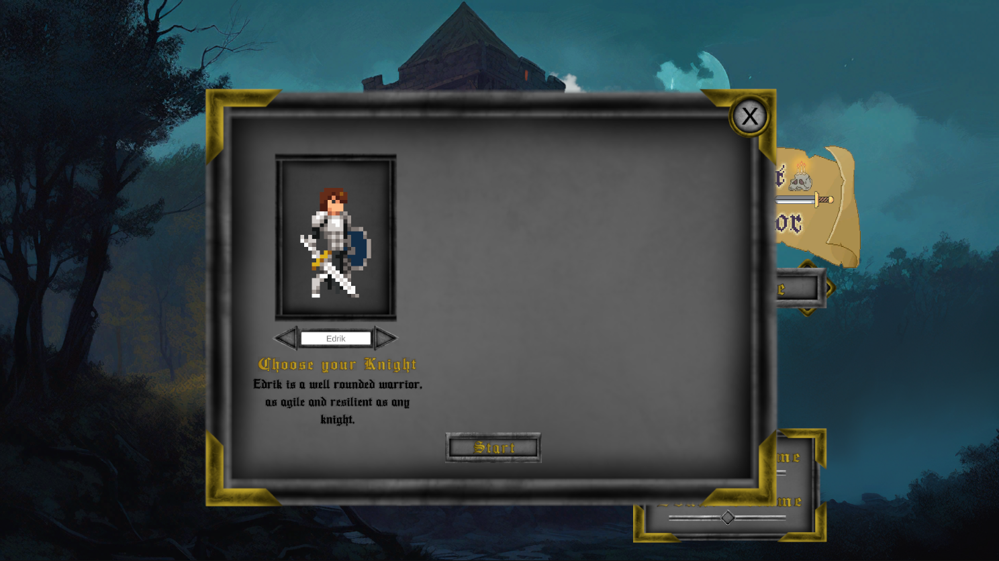
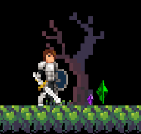

# Moteur De Jeu Project
**Action-Adventure Platformer Roguelite**

**Developer:** François Brinck-Boucher  
**School Project:** Game Engine Development - Collège LaSalle  
**Status:** In Development  

## 🎮 Play the Game
**itch.io:** https://brinckotron.itch.io/togv  
**Password:** jeuvideo

*Main menu with character selection and audio controls*

## 📖 Project Overview

What began as a first-semester game engine class project at Collège LaSalle has evolved into an ambitious action-adventure platformer roguelite. While I initially bit off more than I could chew with the scope, the project has become a testament to my persistence and growing technical skills. Despite the challenges, I continue development as this represents significant time, effort, and personal investment in my game development journey.

## 🎯 Game Description

A 2D action-adventure platformer roguelite featuring:
- **Fluid character movement** with state-based animation system
- **Multiple playable characters** with unique stat distributions
- **Combat system** with melee attacks, dodging, and throwable weapons
- **Progressive character development** through XP and leveling systems
- **Arena-based encounters** with intelligent enemy AI
- **Dynamic audio and visual effects** with post-processing integration

*Multi-character system with unique stat distributions and visual previews*

## 🛠️ Technical Skills Demonstrated

### **Core Unity Development**
- **C# Programming:** Object-oriented design with inheritance, polymorphism, and design patterns
- **Unity Engine:** 2D physics, animation systems, scene management, prefab workflows
- **Component Architecture:** Modular, reusable components following Unity best practices

### **Game Systems Architecture**
- **Singleton Pattern:** Centralized game state management through `GameManager`
- **State Machines:** Robust player state system handling 15+ distinct states (Idle, Run, Attack, Roll, etc.)
- **Event-Driven Programming:** Delegate patterns for audio management and enemy death events
- **Polymorphic Enemy AI:** Abstract base class `EnemyBehaviour` with specialized implementations for different enemy types

### **Advanced Programming Concepts**
- **Inheritance Hierarchies:** `EnemyBehaviour` → `LandEnemy`/`FlyerEnemy` → Specific enemy controllers
- **Interface Design:** Abstract classes for pickable items and breakable objects
- **Coroutine Management:** Complex animation sequences, timed effects, and state transitions
- **Data Encapsulation:** Property-based access control and private field management

### **UI/UX Development**
- **Dynamic UI Systems:** Real-time health, stamina, and XP bar updates with visual feedback
- **Menu Architecture:** Multi-layered menu systems with pause functionality
- **Character Selection:** Data-driven character stats with visual preview system
- **Death Screen:** Animated reveal sequence with statistical tracking

*Pause menu system with post-processing effects and volume controls*

*Character progression screen with detailed statistics and inventory management*

### **Audio Integration**
- **Dynamic Audio Management:** Volume controls with real-time adjustment
- **Spatial Audio:** Position-based sound effects with pitch variation
- **Music System Integration:** Background music management with scene transitions

### **Graphics and Visual Effects**
- **Universal Render Pipeline (URP):** Modern rendering pipeline implementation
- **Post-Processing Stack:** Custom chromatic aberration and vignette effects
- **Animation Controller Integration:** Multi-character animation system with runtime controller swapping
- **Visual Feedback Systems:** Screen effects for damage, UI element highlighting

### **Physics and Movement**
- **2D Physics Integration:** Rigidbody-based movement with custom collision detection
- **Advanced Platforming:** Coyote time implementation, wall detection, ledge jumping
- **Combat Physics:** Damage dealing, knockback systems, and invincibility frames

### **Game Design Patterns**
- **Component Pattern:** Modular, reusable components for items, enemies, and effects
- **Observer Pattern:** Event systems for game state changes and audio management
- **Factory Pattern:** Dynamic enemy and item spawning systems
- **Strategy Pattern:** Different AI behaviors based on enemy type and state

## 🔧 Technical Challenges & Solutions

### **Challenge 1: Complex State Management**
**Problem:** Managing intricate player states while maintaining responsive controls  
**Solution:** Implemented a comprehensive state machine with priority-based state transitions and input buffering

### **Challenge 2: Scalable Enemy AI**
**Problem:** Creating diverse enemy behaviors without code duplication  
**Solution:** Developed an abstract enemy base class with virtual methods, allowing for specialized behaviors while maintaining consistent core functionality

### **Challenge 3: Performance Optimization**
**Problem:** Maintaining smooth gameplay with multiple enemies and effects  
**Solution:** Implemented object pooling concepts, efficient collision detection using layer masks, and optimized animation callbacks

### **Challenge 4: Cross-Scene Data Persistence**
**Problem:** Maintaining player progress across scene transitions  
**Solution:** Created a persistent `GameManager` singleton using `DontDestroyOnLoad`, ensuring seamless data continuity

### **Challenge 5: Audio System Integration**
**Problem:** Managing multiple audio sources without conflicts  
**Solution:** Developed a centralized audio management system with volume controls and dynamic AudioSource instantiation

## 🎨 Assets and Technology Stack

### **Unity Technologies**
- **Unity Engine 2022.3 LTS**
- **Universal Render Pipeline (URP) 14.0.8**
- **TextMeshPro** for UI text rendering
- **2D Animation Package** for character animations
- **Unity Physics 2D** for collision detection and movement

### **Programming Languages & Frameworks**
- **C#** (Primary development language)
- **Unity's Component System**
- **.NET Framework**

### **Development Tools**
- **Unity Editor** with custom inspector configurations
- **Git Version Control** (evidenced by .gitignore and project structure)
- **Rider IDE** integration for advanced debugging

## 🎮 Game Features Implemented

### **Character System**
- Three distinct character classes with unique stat distributions
- Runtime animation controller swapping
- Character-specific dialogue and descriptions

### **Combat Mechanics**
- Melee attack system with animation-driven timing
- Defensive mechanics (rolling, future blocking implementation)
- Throwable weapon system with multiple projectile types
- Stamina-based action limitation

*Arena-based combat encounters with intelligent enemy AI and environmental interactions*

### **Progression Systems**
- Experience point accumulation and level advancement
- Character sheet with detailed statistics
- Inventory management for throwable items
- Statistical tracking (kills, chests opened, gold collected)

### **World Systems**
- Multi-scene architecture with additive loading
- Portal system for area transitions
- Interactive NPCs and shop systems
- Arena-based combat encounters
- Collectible and loot systems

*Interactive NPC systems with contextual dialogue and shop mechanics*

*Comprehensive loot system with various collectibles and visual feedback*

### **Audio-Visual Polish**
- Dynamic post-processing effects
- Particle effects for combat and environmental interactions
- Comprehensive audio feedback for all player actions
- Smooth camera following with position constraints

## 📊 Current Development Status

### **Completed Systems**
- ✅ Core player movement and combat
- ✅ Enemy AI framework and implementations
- ✅ UI systems and menu management
- ✅ Audio integration and management
- ✅ Basic progression mechanics
- ✅ Multi-character support
- ✅ Scene management and transitions

### **In Progress**
- 🔄 Save/Load system implementation
- 🔄 Advanced roguelite mechanics
- 🔄 Additional enemy types and encounters
- 🔄 Equipment and upgrade systems

### **Planned Features**
- 📋 Procedural level generation
- 📋 Advanced RPG mechanics
- 📋 Boss encounters
- 📋 Story and dialogue systems

## 🎯 Skills Developed Through This Project

### **Technical Skills**
- Advanced C# programming with Unity integration
- Complex state machine implementation
- Event-driven architecture design
- Performance optimization techniques
- Cross-platform game development workflow

### **Problem-Solving Skills**
- Breaking down complex systems into manageable components
- Debugging complex interaction systems
- Balancing code maintainability with performance requirements
- Adaptive development when scope exceeds initial planning

*Animated death screen with statistical tracking and smooth UI transitions*

### **Project Management**
- Long-term project commitment and persistence
- Iterative development methodologies
- Feature prioritization and scope management
- Self-directed learning and skill acquisition

## 📝 Development Reflection

This project represents significant growth in my game development capabilities. What started as an academic exercise became a deep dive into professional game development practices. The challenges of managing scope while maintaining code quality taught valuable lessons about project planning and sustainable development practices.

The decision to continue development beyond the academic requirements demonstrates my commitment to completing meaningful projects and my passion for game development. Each system implemented represents not just functional code, but an understanding of how complex interactive systems work together to create engaging player experiences.

---

**Note:** This project continues to evolve as I develop new skills and implement additional features. The codebase represents a practical application of computer science principles in an interactive entertainment context.